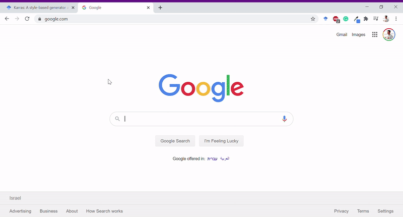
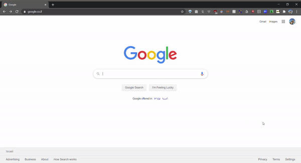

# Scholar With Code

A simple chrome extension to present the number of available code implementations (via `Papers With Code`) for articles listed on `Google Scholar` and `arXiv`.

 

## Recent Updates
**`2021.11.18`**: Minor fix to support changes in `Papers With Code`

**`2020.07.15`**: Added arXiv Support

**`2020.06.24`**: Chrome Extension release

**`2020.06.16`**: First Release

## Why?
Two of the most used tools for me during research are `Google Scholar` and `Papers with Code`, together giving a full view of citations and code implementations.

I've noticed that a thing that I do a lot is to start from a paper I know, go through the  "Papers that cite this work" page on `Google Scholar`, and then for each paper check whether it has a code implementation using `Papers With Code`.

As it is kind of annoying to go back and forth between the two, I've written a small chrome extension that shows whether the paper has code implementation and links to the matching page on `Papers with Code`.

 

 ## Installation

 Extension is available in the [Chrome Web Store](https://chrome.google.com/webstore/detail/scholar-with-code/nlnjigejpgngahmoainkakaafabijeki). Alternatively you can download the project directory and drag it to your chrome extensions.

## TODOs
- [x] Publish to Chrome Web Store
- [x] Check how to remove permissions to all sites
- [x] Support arXiv.org
